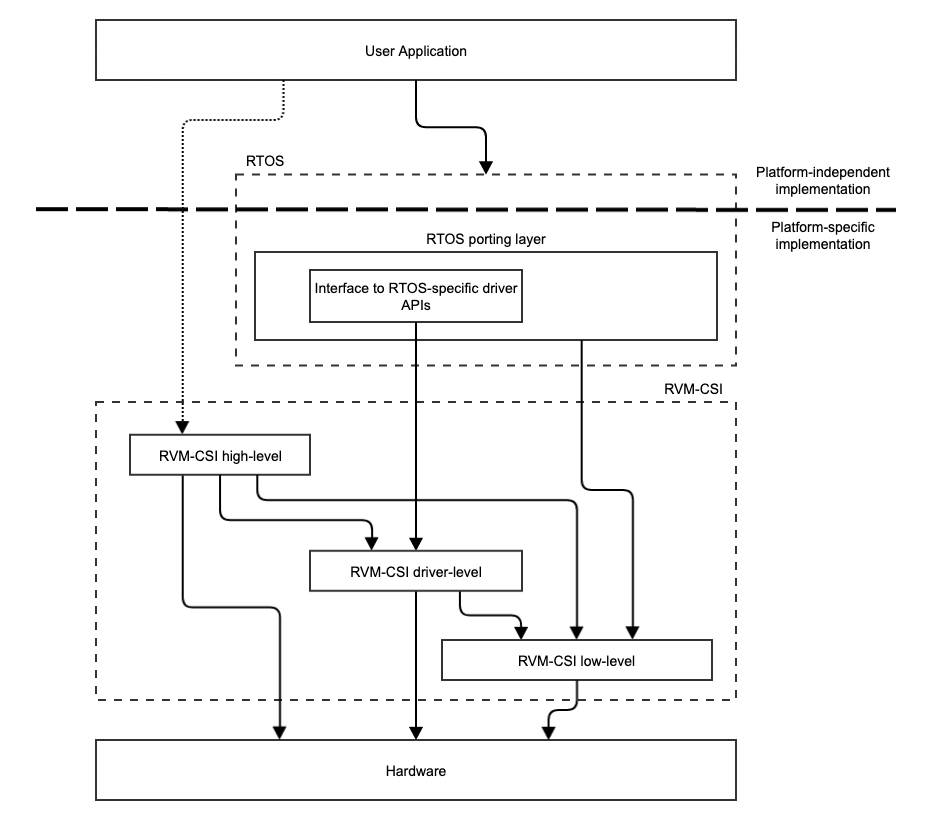
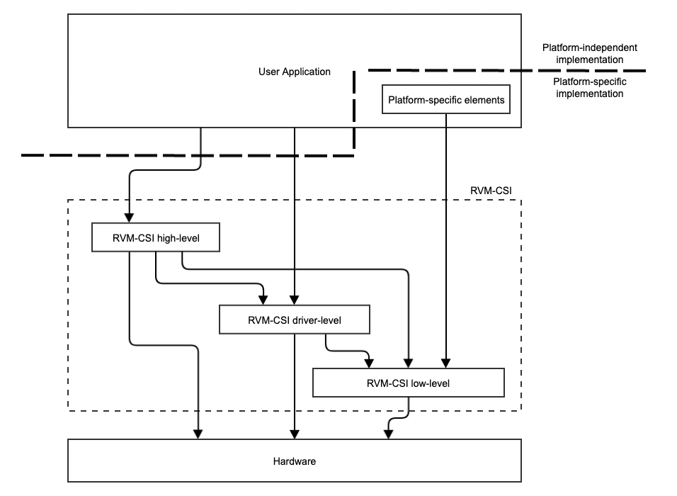

# RVM-CSI Gap Analysis and Requirements Gathering

## Introduction

This document presents the formal gap analysis for RVM-CSI (RISC-V Microcontrollers - Common Software Interface).

The aims of this analysis are:
- Examine what gaps there are in the RISC-V software ecosystem relating to the SIG charter aims.
- Examine what RISC-V software solutions are existing in this space and how they might be aligned, improved or supplemented.
- Examine if and how these gaps are filled within the (currently predominant) ARM-based ecosystem.
- Survey the requirements of likely end users
- Outline the strategy by which the aims of the SIG charter will be met.

## SIG Charter

This is copied below for convenience:

> The RVM-CSI SIG drives the strategy and coordinates the development of RISC-V&apos;s Common Software Interface (CSI) for RISC-V Microcontrollers.
>
> RVM-CSI is to provide a source-level portability layer providing a simplified transition path between different microcontrollers based on RISC-V.  It may define programming interfaces in multiple programming languages, derived from a single source of truth which determines common function and macro names and descriptions across all implemented languages.  The RVM-CSI SIG drives the strategy and coordinates the development of the entire solution and ensures integration with other RISC-V initiatives, such as Toolchains, Performance Analysis, and Unified Discovery.
>
> The group has governance for the RVM-CSI specification and compatibility test-suite, and drives the outreach to related upstream projects.
>
> The RVM-CSI SIG covers the following activities:
>
> - Provides gap analysis, strategy development, requirements analysis, and outreach for RVM-CSI on behalf of the Software HC
> - Develops the roadmap and proposes the creation of TGs for the development of the RVM-CSI core specification, extensions, and compatibility test-suites
> - Drives the outreach to external (Open-Source, Academic, and Commercial) projects and actively recruits partners to develop RVM-CSI
> - Works with membership to establish guidelines and documentation
> - Provides RVM-CSI expertise to other specification effort including early review of requirements and gap-analysis

## Background

RVM refers to a class of platforms and profiles which RISC-V International originally intended to define. A profile defines a specific base ISA, plus ISA extensions and any options applicable within those ISA extensions. A platform comprises a profile plus further specifications for non-ISA features (such as interrupt controllers etc.).

The motivation behind defining these profiles and platforms is to constrain the features of a RISC-V platform in order to make it easier to write software that is portable between platforms. This is most important in the application processor space, where binary distributions need to be created that will work on platforms from multiple vendors. Hence most focus in this area has been on the RVA (application processor) platforms.

In the embedded space, there is no longer an intention, at least in the near future at time of writing, to define the RVM platforms and profiles. Rather, since we assume that software will be built for a specific embedded platform, we can deal with the problem of software portability by creating a software layer that abstracts the features of the platform. Hence the motivation behind RVM-CSI.

In constructing systems for RVM platforms, we assume the following:
- The software is built for a specific platform (i.e., platform characteristics are known at build time).
- The software is not using a rich OS such as linux (which would have its own standardized methods for control of the platform and discovery of its characteristics).

## Assumed Features of Underlying Hardware

### Privilege Levels

We assume that systems targeted by RVM-CSI will require either Machine-mode only, or Machine mode + User mode. No functionality is provided to target Hypervisor, Supervisor or VS privilege modes.

### Virtual Memory

RVM-CSI does not require to support systems with virtual addressing.

## Key Stakeholders and their Requirements

### Software Authors

Software writers who wish to use the RVM-CSI Application Programming Interface (API) may fall broadly into the following groups:
1. People creating "bare-metal" systems (that they might like to be portable between RISC-V platforms).
2. People porting "bare-metal" systems from ARM or other architectures to RISC-V.
3. People writing applications running on an Operating System (OS).
4. People porting an (OS) to work on a RISC-V platform.
5. People writing device drivers for an OS.

Regarding the aim of portability, as outlined in the charter, it should be noted that one of the features of an OS is to provide a portable, platform-agnostic programming layer.  Furthermore, many existing OS's aimed at microcontrollers have a significant existing user base.  If "bare-metal" systems creators are interested in portability, then they have the option of using an OS to achieve this.  Therefore, users in groups 4 and 5 should be considered particularly important.

In addition to the issue of code portability, however, users simply require a convenient way to interface to the hardware of a given platform: for example they would like convenience functions for manipulating aspects of the core, and they need to use names rather than numeric values to reference addresses, CSR indices, bit-fields within registers, etc.  This more modest aim, rather than the larger aim of portability, is an important focus of many existing Hardware Abstraction Layers (HALs).

Some simple Real Time Operating Systems (notably FreeRTOS) do not provide an interface to many hardware components; this is left up to the user.  People writing applications aimed at this type of OS may therefore benefit from similar functionality to those working on bare-metal systems.

### Platform Vendors

Platform vendors want to ensure that development on their platform is as easy as possible, and may wish to supply code to facilitate this aim.  They may be interested in limited portability across their own range of platforms (in preference to portability across all RISC-V platforms).  Primarily, they need a way of communicating to their users how to interface software to their platform.  The most practical way to do this communication is by writing code to implement a commonly used API.  So far, the absence of agreement on such an API has led individual vendors to publish their own HALs, leading to fragmentation in this area of the RISC-V software ecosystem.  If RVM-CSI becomes widely adopted, or if it looks like it will be, then platform vendors may chose it for this purpose. Alternatively (or in addition), they may choose to port a popular OS to their platform.

### Toolkit Vendors

Toolkit vendors may have similar aims to platform vendors regarding offering code to implement a HAL for any supported platform. In addition, they may be interested in a standardized way of feeding information about a platform into other areas of the toolkit. For example, an IDE may present views of memory, peripheral registers and Control and Status Registers (CSRs) which are tailored to the platform.  A standardized way of importing platform information into a toolkit (both HAL code and meta-data describing aspects of the platform) may be of interest.  This is another area that RVM-CSI could address; although we note that this is an area where co-ordination with Unified Discovery TG may be required.

## Abstraction Levels

A key aim of this analysis is to identify what level, or levels, of abstraction the RVM-CSI API should sit at.  This trade-off is illustrated below:

To illustrate the choices to be made, consider an API for interrupt handling.  If the abstraction level is set high enough, then the hardware can be fully abstracted, and code written to the API can be highly portable. The API could enumerate signal sources in the system, provide functions for routing them to a hart, and allow the user to register a C handler for a given interrupt source.  The HAL implementation underneath the API in this case would provide a base trap handler which deals with register save and restore, and interfaces to the specific hardware in the platform.  This might be a very useful API for someone creating a bare-metal system who doesn't have exacting requirements for interrupt latency etc.  However, an API at this level will not be flexible enough to meet the requirements of someone porting an OS, or someone wanting to supply their own base trap handler. By contrast, an API which is more like a thin wrapper around a specific piece of interrupt hardware, such as a PLIC, could be of great benefit to people porting an OS (by abstracting away platform-specific register addresses etc.).  But code written to such an API will not be portable to systems that use (for example) AIA instead of PLIC.

To take another example, Zephyr defines [a standardized driver interface][1] which is intended to be a platform-agnostic software layer. Drivers are implemented to this interface and it is assumed that those drivers would call low-level HAL functions to interface to the hardware.  But, with portability as an aim,  RVM-CSI could consider implementing functions at the same abstraction level as this driver API (with any OS-specific constructs removed); either instead of, or in addition to, any low-level functionality. (That is, most of the driver functionality  could be implemented underneath the RVM-CSI API rather than on top of it).  This might give a more useful and portable API, but risks not matching all users requirements, since those requirements are hard to predict.

## Study of Existing Hardware Abstraction Layers

### [CMSIS][3]

This is a software layer (+ other components) maintained by ARM to support their cores.  It is widely adopted.  It is implicitly assumed that RVM-CSI is RISC-V's answer to CMSIS.

If we need to encourage embedded developers to switch from ARM to RISC-V then we should pay attention to this API as it will be easier for those people to switch to using an API that looks similar.  However, it is not universally liked, so we should assess the scope for doing something better.  In addition it is very specific to ARM cores, so cannot be adopted wholesale.

The run-time API aspect of CMSIS is modular in 5 parts:
- **Core(A)** or **Core(M)** present low-level interfaces to specific hardware components.  There is no portability aspect here, indeed there are 2 separate versions of the API for different classes of ARM processor (A and M class).  However, this is an essential mechanism by which ARM communicates to software developers how to control their cores, and an undoubtedly useful abstraction.  It indirectly helps portability, by assisting in the writing of drivers etc. to contribute to higher-level portable software layers, even though the APIs themselves are not portable.
- **RTOS** (v1 and v2) attempts to abstract RTOS functionality.  This seems out of scope for RVM-CSI.
- **Driver** presents a platform-agnostic driver API to allow standardized control of peripherals.  This potentially aligns with RVM-CSI's portability goal. Drivers implemented to this API may themselves use the lower-level Core API.
- **DSP** and **NN** present high-level APIs for DSP / Neural Network functionality.  Whether this is in-scope for RVM-CSI may depend on how much hardware-specific content needs to be implemented underneath these APIs.  Being relatively high-level, it may be hard to get the APIs right, to serve the requirements of a large user base; so we should check the level of adoption if possible.  If these interfaces are widely used, then there would be a case for including this functionality within RVM-CSI.  However, as a general principle, it is not within the RVM-CSI remit to supply general-purpose software libraries.

There are also a number of components of CMSIS beyond run-time software support:
- **DAP** is firmware for debuggers conforming to the CoreSight debugging framework.  Not in scope for RVM-CSI.
- **SVD** specifies a file format describing memory-mapped peripheral registers (typically used to communicate this information to an IDE or other tool).  This is useful, and RISC-V should consider either adopting the same format (for compatibility with existing ARM systems) or doing something equivalent.  The relationship of this to Unified Discovery in RISC-V should be considered.
- **Pack** and  **Toolbox** (formerly **Build**) are about software package management.  It is potentially within scope for RVM-CSI to specify the way in which RVM-CSI implementations should be packaged and delivered to end users, such that knowledge of a new platform, and code to support it, can be easily installed into a toolkit, for example.
- **Zone** is very specific software related to ARM's security features so is not in scope for RVM-CSI.

### [T-Head CSI][2]

This presents an API for RISC-V processors that seems closely modelled on CMSIS.  Indeed it is modular in 5 parts which correspond directly to the equivalent modules in CMSIS (CSI-CORE, CSI-KERNEL, CSI-DRIVER, CSI-DSP, CSI-NN).  Most of the core module is generic RISC-V, but there are aspects that relate specifically to the T-head Xuantie 910 processor.

### [NMSIS][4]

This is again quite analogous to CMSIS but only implements the Core, DSP and NN modules.  The core module is a mix of things which are generic RISC-V and things which are quite specific to Nuclei N/NX class processors.

### SiFive [Freedom Metal][5]

A single library of functionality aimed at supporting bare-metal development on SiFive platforms.  It is somewhat different from the CMSIS model, and some of the functionality (e.g. interrupt handling) is set at a higher level of abstraction.  It is integrated with SiFive's toolchain.

### [Zephyr Device Driver APIs][1]

If specifying platform-agnostic driver APIs we should consider this layer within Zephyr, in addition to considering the existing APIs in CMSIS and the T-Head CSI.  Zephyr is a popular RTOS, and aligning to this layer would help with porting it to RISC-V platforms.  This may help with driving adoption.

### [STM32Cube][6]

This "ecosystem" attempts to provide an "all-in-one" development solution for ST's ARM-based microcontrollers.  It includes many components outside of RVM-CSI's remit including build systems, monitoring systems, an IDE, and a range of software components.  Amongst this are two software layers which align with the RVM-CSI aims: one called the HAL and another called LL (low-level).  The HAL generally aims at software portability, and an API with generic functionality (more customized functionality targeting particular cores is also included in a separate extension module).  The LL code is close to specific hardware, and its API aligns with the functionality of the hardware itself.  One other important distinction is that the HAL may use static data and independently-running software processes, whereas the LL does not: the LL relies on the hardware itself for all storage of state.

## Cryptography

Cryptography is an area not generally covered by the HALs mentioned above, but it is an area that is commonly supported by hardware acceleration, so should fall within the RVM-CSI remit.

The required cryptography operations are relatively easily defined in a hardware-independent way.  Furthermore, there is an existing API in this space that is fully platform independent and widely adopted: ARM's [PSA API][7].  After consulting widely among cryptography experts, there is a strong majority view that we should align with this API in RISC-V.

## Weaknesses of Existing Software in this Space

The primary and most obvious weakness of the existing RISC-V software in this space is that it is fragmented, aimed at supporting specific vendor's products, and insufficiently general.  Hence the motivation for forming the RVM-CSI SIG to promote standardisation.

There are some other weaknesses that we should consider:
- There is no support for multiple privilege levels: it seems that M-mode-only systems have been largely assumed.
- In some cases the functionality may not be fully thread-safe: implementation may rely on static data within the HAL implementation.
- People constructing bare-metal systems might like APIs which are at a higher level of abstraction and thus easier to use.  This comment applies also to people developing on a very "thin" RTOS like FreeRTOS.  (FreeRTOS doesn't deal with interfacing to peripherals).

## Bare-metal Systems

As cheap hardware becomes more powerful, and as the focus on security concerns increases, the prevalence of operating systems in the embedded microcontroller space is increasing, and one might question the importance of "bare-metal" systems in the real world.  However, the importance of easily creating a bare-metal system, either as a learning exercise, or as a step towards creation of a larger system, should not be under-stated.  A key factor in promoting the switch to RISC-V is helping new developers to create tutorial applications.

## Proposed Strategy

### Run-Time HAL APIs

RVM-CSI should supply run-time APIs for general-purpose hardware abstraction on 3 complimentary levels:
- **Low-level**: These APIs will wrap specific pieces of hardware within a RISC-V platform, providing a convenient way to control that hardware from a high-level language.  The hardware covered may include both standard aspects of a RISC-V core and peripherals.  The APIs should aim to offer access to all the functionality within the hardware itself.  They will not always be portable to other implementations of the same class of hardware.
- **Driver-level**: These will be platform-agnostic APIs aiming to offer functionality that requires interaction with hardware peripherals; specified in a way that abstracts the implementation details of the actual peripherals present in the platform.  These APIs should be designed with a focus on creating peripheral drivers that will work across multiple different RISC-V platforms; including drivers for an RTOS (such as Zephyr).  Driver-level APIs will typically use the low-level APIs in their implementation.
- **High-level**: These will be APIs at a higher level of abstraction offering a more convenient way for a user application to interact with platform hardware, particularly aimed at bare-metal systems or systems with a very thin OS such as FreeRTOS.  Multiple code modules may be offered at this level. Functionality covered may include, for example, an interrupt and timer sub-system, and a mechanism for formatted logging output via UART or other mechanisms. High-level APIs will typically use both driver-level and low-level APIs in their implementation.

Functionality within the driver-level APIs may require an interrupt and timer subsystem to function correctly.  Where an OS is present this functionality can be provided by the OS.  For bare-metal systems, functionality within the high-level APIs can be used (this would be managed by the user application).

All of the code underneath these RVM-CSI APIs is considered to be platform-specific, and would typically be provided as a Board Support Package (BSP) by a platform vendor.  However in practice, much of the code, particularly at driver-level and high-level, can be formed from common code with a few build-time options to tailor its behaviour to the platform.  This makes implementation of a BSP for a new platform much easier.  The use of the low-level API to provide platform-specific information (such as addresses) to the driver-level code in a standard form helps to facilitate this.

The following diagram illustrate how these APIs might fit within a user application which makes use of an RTOS:

The following diagram illustrates how a bare-metal application might make use of these APIs:

Note that for some existing HALs, a single organization is responsible both for defining the API and for implementing the code under it.  As a result, the distinction between the API and its implementation for a particular platform has become indistinct.  In the case of RVM-CSI the specification must be very clear about who is responsible for implementing what; so that standard cross-platform components can be implemented separately from vendor-specific components.

The APIs should be formulated in a way that allows for use in systems with a machine-mode / user-mode split, as well as in M-mode only systems.  They should also allow for a thread-safe (re-entrant) implementation such that separate instances of the RVM-CSI system can operate in parallel on different hardware threads within a single-elf multi-core or multi-thread application.

The APIs should take into account that the code will be built for a specific platform, so platform characteristics are known at build time: run-time discovery of fixed platform characteristics is unnecessary and potentially wasteful of resources.  However, compiler optimization can be used to eliminate any run-time code that always produces the same result for a given platform.

Implementations of RVM-CSI may be supplied either in binary or source code form.  This has implications for the APIs and for the implementation.  For example in C, to support binary library distribution, pre-processor directives that are intended to change system behaviour at run-time must only be used in header files, not within the compiled C-code.

### DSP and Neural Network APIs

These could be considered as an extension to the set of high-level HAL APIs.  To the extent that the CMSIS APIs in this area are platform-independent, we should aim to match them exactly, since the motivation for including them is to cater for existing users of those CMSIS APIs.

### Cryptography API

RVM-CSI should specify alignment to the [ARM PSA API][7] on cryptography.

### Other Aspects of the Specification

RVM-CSI should specify a standard format for a board support pack which delivers an RVM-CSI implementation for a given platform.  This will include meta-data to allow both information about the platform and the supporting software libraries to be imported into a toolkit, SDK or IDE.

This should also include specifying a standard way of supplying low-level platform-specific startup code (assembler code that needs to run prior to entering main(), dealing with cache setup etc.).

[1]: https://docs.zephyrproject.org/apidoc/latest/group__io__interfaces.html
[2]: https://occ.t-head.cn/document?temp=t-head-chip-standard-interface-csi&slug=csi
[3]: https://github.com/ARM-software/CMSIS_5
[4]: https://doc.nucleisys.com/nmsis/core/overview.html
[5]: https://sifive.github.io/freedom-metal-docs/index.html
[6]: https://www.st.com/content/st_com/en/ecosystems/stm32cube-ecosystem.html
[7]: https://github.com/ARM-software/psa-api
